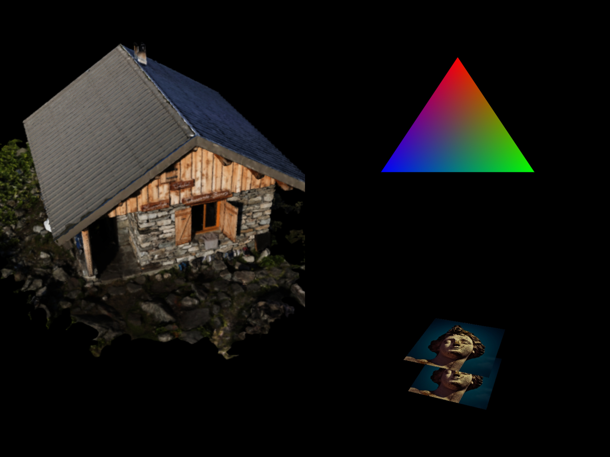

# Vulkan-Tutorial-Java
Java port of the [great tutorial by Alexander Overvoorde](https://vulkan-tutorial.com/). The original code can be found [here](https://github.com/Overv/VulkanTutorial).

 

---
* [Introduction](#introduction)
* [LWJGL](#lwjgl)
   * [Native handles](#native-handles)
   * [Pointers and references](#pointers-and-references)
   * [Stack allocation](#stack-allocation)
* [Drawing a triangle](#drawing-a-triangle)
   * [Setup](#setup)
      * [Base code](#base-code)
      * [Instance](#instance)
      * [Validation layers](#validation-layers)
      * [Physical devices and queue families](#physical-devices-and-queue-families)
      * [Logical device and queues](#logical-device-and-queues)
   * [Presentation](#presentation)
      * [Window surface](#window-surface)
      * [Swap chain](#swap-chain)
      * [Image views](#image-views)
   * [Graphics pipeline basics](#graphics-pipeline-basics)
      * [Introduction](#introduction-1)
      * [Shader Modules](#shader-modules)
      * [Fixed functions](#fixed-functions)
      * [Render passes](#render-passes)
      * [Conclusion](#conclusion)
   * [Drawing](#drawing)
      * [Framebuffers](#framebuffers)
      * [Command buffers](#command-buffers)
      * [Rendering and presentation](#rendering-and-presentation)
   * [Swapchain recreation](#swapchain-recreation)
* [Vertex buffers](#vertex-buffers)
    * [Vertex input description](#vertex-input-description)
    * [Vertex buffer creation](#vertex-buffer-creation)
    * [Staging buffer](#staging-buffer)
       * [Version with dedicated Transfer Queue](#version-with-dedicated-transfer-queue)
    * [Index buffer](#index-buffer)
* [Uniform buffers](#uniform-buffers)
    * [Descriptor layout and buffer](#descriptor-layout-and-buffer)
    * [Descriptor pool and sets](#descriptor-pool-and-sets)
* [Texture mapping](#texture-mapping)
    * [Images](#images)
    * [Image view and sampler](#image-view-and-sampler)
    * [Combined image sampler](#combined-image-sampler)
* [Depth buffering](#depth-buffering)
* [Loading models](#loading-models)
* [Generating Mipmaps](#generating-mipmaps)
* [Multisampling](#multisampling)

## Introduction

These tutorials are written to be easily followed with the C++ tutorial. However, I've made some changes to fit the Java and LWJGL styles. The repository follows the same structure as in the [original one](https://github.com/Overv/VulkanTutorial/tree/master/code).

Every chapter have its own Java file to make them independent to each other. However, there are some common classes that many of them need:

  - [AlignmentUtils](src/main/java/javavulkantutorial/AlignmentUtils.java): Utility class for dealing with uniform buffer object alignments.
  - [Frame](src/main/java/javavulkantutorial/Frame.java): A wrapper around all the necessary Vulkan handles for an in-flight frame (*image-available semaphore*, *render-finished semaphore* and a *fence*).
  - [ModelLoader](src/main/java/javavulkantutorial/ModelLoader.java): An utility class for loading 3D models. They are loaded with [Assimp](http://www.assimp.org/).
  - [ShaderSPIRVUtils](src/main/java/javavulkantutorial/ShaderSPIRVUtils.java): An utility class for compiling GLSL shaders into SPIRV binaries at runtime.
  
For maths calculations I will be using [JOML](https://github.com/JOML-CI/JOML), a Java math library for graphics mathematics. Its very similar to [GLM](https://glm.g-truc.net/0.9.9/index.html).

Finally, each chapter have its own .diff file, so you can quickly see the changes made between chapters.

Please note that the Java code is more verbose than C or C++, so the source files are larger.

## LWJGL

I'm going to be using [LWJGL (Lightweight Java Game Library)](https://www.lwjgl.org/), a fantastic low level API for Java with bindings for GLFW, Vulkan, OpenGL, and other C libraries.

If you don't know LWJGL, it may be difficult to you to understand certain concepts and patterns you will see throughout this tutorials. I will briefly explain some of the most important
concepts you need to know to properly follow the code.

### Native handles

Vulkan has its own handles named properly, such as VkImage, VkBuffer or VkCommandPool. These are unsigned integer numbers behind the scenes, and because Java
does not have typedefs, we need to use *long* as the type of all of those objects. For that reason, you will see lots of *long* variables.

### Pointers and references

Some structs and functions will take as parameters references and pointers to other variables, for example to output multiple values. Consider this function in C:

```C

int width;
int height;

glfwGetWindowSize(window, &width, &height);

// Now width and height contains the window dimension values

```

We pass in 2 *int* pointers, and the function writes the memory pointed by them. Easy and fast.

But how about in Java? There is no concept of pointer at all. While we can pass a copy of a reference and modify the object's contents inside
a function, we cannot do so with primitives.
We have two options. We can use either an int array, which is effectively an object, or to use [Java NIO Buffers](https://docs.oracle.com/javase/7/docs/api/java/nio/Buffer.html).
Buffers in LWJGL are basically a windowed array, with an internal position and limit. We are going to use these buffers, since we can allocate them off heap, as we will see later.

Then, the above function will look like this with NIO Buffers:

```Java

IntBuffer width = BufferUtils.createIntBuffer(1);
IntBuffer height = BufferUtils.createIntBuffer(1);

glfwGetWindowSize(window, width, height);

// Print the values 
System.out.println("width = " + width.get(0));
System.out.println("height = " + height.get(0));
```

Nice, now we can pass pointers to primitive values, but we are dynamically allocating 2 new objects for just 2 integers.
And what if we only need these 2 variables for a short period of time? We need to wait for the Garbage Collector to get rid of those 
disposable variables.

Luckily for us, LWJGL solves this problem with its own memory management system. You can learn about that [here](https://github.com/LWJGL/lwjgl3-wiki/wiki/1.3.-Memory-FAQ).

### Stack allocation

In C and C++, we can easily allocate objects on the stack:

```C++

VkApplicationInfo appInfo = {};
// ...

```

However, this is not possible in Java.
Fortunately for us, LWJGL allows us to kind of stack allocate variables on the stack. For that, we need a [MemoryStack](https://javadoc.lwjgl.org/org/lwjgl/system/MemoryStack.html) instance.
Since a stack frame is pushed at the beginning of a function and is popped at the end, no matter what happens in the middle, we should
use try-with-resources syntax to imitate this behaviour:

```Java

try(MemoryStack stack = stackPush()) {

  // ...
  
  
} // By this line, stack is popped and all the variables in this stack frame are released

```

Great, now we are able to use stack allocation in Java. Let's see how it looks like:

```Java

try(MemoryStack stack = stackPush()) {

  IntBuffer width = stack.mallocInt(1); // 1 int unitialized
  IntBuffer height = stack.ints(0); // 1 int initialized with 0

  glfwGetWindowSize(window, width, height);

  // Print the values 
  System.out.println("width = " + width.get(0));
  System.out.println("height = " + height.get(0));
}

```

Now let's see a real Vulkan example with *MemoryStack*:

```Java

private void createInstance() {

    try(MemoryStack stack = stackPush()) {

        // Use calloc to initialize the structs with 0s. Otherwise, the program can crash due to random values

        VkApplicationInfo appInfo = VkApplicationInfo.calloc(stack);

        appInfo.sType(VK_STRUCTURE_TYPE_APPLICATION_INFO);
        appInfo.pApplicationName(stack.UTF8Safe("Hello Triangle"));
        appInfo.applicationVersion(VK_MAKE_VERSION(1, 0, 0));
        appInfo.pEngineName(stack.UTF8Safe("No Engine"));
        appInfo.engineVersion(VK_MAKE_VERSION(1, 0, 0));
        appInfo.apiVersion(VK_API_VERSION_1_0);

        VkInstanceCreateInfo createInfo = VkInstanceCreateInfo.calloc(stack);

        createInfo.sType(VK_STRUCTURE_TYPE_INSTANCE_CREATE_INFO);
        createInfo.pApplicationInfo(appInfo);
        // enabledExtensionCount is implicitly set when you call ppEnabledExtensionNames
        createInfo.ppEnabledExtensionNames(glfwGetRequiredInstanceExtensions());
        // same with enabledLayerCount
        createInfo.ppEnabledLayerNames(null);

        // We need to retrieve the pointer of the created instance
        PointerBuffer instancePtr = stack.mallocPointer(1);

        if(vkCreateInstance(createInfo, null, instancePtr) != VK_SUCCESS) {
            throw new RuntimeException("Failed to create instance");
        }

        instance = new VkInstance(instancePtr.get(0), createInfo);
    }
}

```

## Drawing a triangle
### Setup
#### Base code

[Read the tutorial](https://vulkan-tutorial.com/Drawing_a_triangle/Setup/Base_code)

[Original code](https://github.com/Overv/VulkanTutorial/blob/master/code/00_base_code.cpp)

[Java code](src/main/java/javavulkantutorial/Ch00BaseCode.java)

#### Instance

[Read the tutorial](https://vulkan-tutorial.com/Drawing_a_triangle/Setup/Instance)

[Original code](https://github.com/Overv/VulkanTutorial/blob/master/code/01_instance_creation.cpp)

[Java code](src/main/java/javavulkantutorial/Ch01InstanceCreation.java)

[Diff](src/main/java/javavulkantutorial/Ch01InstanceCreation.diff)

#### Validation layers

[Read the tutorial](https://vulkan-tutorial.com/Drawing_a_triangle/Setup/Validation_layers)

[Original code](https://github.com/Overv/VulkanTutorial/blob/master/code/02_validation_layers.cpp)

[Java code](src/main/java/javavulkantutorial/Ch02ValidationLayers.java)

[Diff](src/main/java/javavulkantutorial/Ch02ValidationLayers.diff)


#### Physical devices and queue families

[Read the tutorial](https://vulkan-tutorial.com/Drawing_a_triangle/Setup/Physical_devices_and_queue_families)

[Original code](https://github.com/Overv/VulkanTutorial/blob/master/code/03_physical_device_selection.cpp)

[Java code](src/main/java/javavulkantutorial/Ch03PhysicalDeviceSelection.java)

[Diff](src/main/java/javavulkantutorial/Ch03PhysicalDeviceSelection.diff)


#### Logical device and queues

[Read the tutorial](https://vulkan-tutorial.com/Drawing_a_triangle/Setup/Logical_device_and_queues)

[Original code](https://github.com/Overv/VulkanTutorial/blob/master/code/04_logical_device.cpp)

[Java code](src/main/java/javavulkantutorial/Ch04LogicalDevice.java)

[Diff](src/main/java/javavulkantutorial/Ch04LogicalDevice.diff)

### Presentation

#### Window surface

[Read the tutorial](https://vulkan-tutorial.com/Drawing_a_triangle/Presentation/Window_surface)

[Original code](https://github.com/Overv/VulkanTutorial/blob/master/code/05_window_surface.cpp)

[Java code](src/main/java/javavulkantutorial/Ch05WindowSurface.java)

[Diff](src/main/java/javavulkantutorial/Ch05WindowSurface.diff)

#### Swap chain

[Read the tutorial](https://vulkan-tutorial.com/Drawing_a_triangle/Presentation/Swap_chain)

[Original code](https://github.com/Overv/VulkanTutorial/blob/master/code/06_swap_chain_creation.cpp)

[Java code](src/main/java/javavulkantutorial/Ch06SwapChainCreation.java)

[Diff](src/main/java/javavulkantutorial/Ch06SwapChainCreation.diff)

#### Image views

[Read the tutorial](https://vulkan-tutorial.com/Drawing_a_triangle/Presentation/Image_views)

[Original code](https://github.com/Overv/VulkanTutorial/blob/master/code/07_image_views.cpp)

[Java code](src/main/java/javavulkantutorial/Ch07ImageViews.java)

[Diff](src/main/java/javavulkantutorial/Ch07ImageViews.diff)

### Graphics pipeline basics
#### Introduction

[Read the tutorial](https://vulkan-tutorial.com/Drawing_a_triangle/Graphics_pipeline_basics)

[Original code](https://github.com/Overv/VulkanTutorial/blob/master/code/08_graphics_pipeline.cpp)

[Java code](src/main/java/javavulkantutorial/Ch08GraphicsPipeline.java)

[Diff](src/main/java/javavulkantutorial/Ch08GraphicsPipeline.diff)

#### Shader Modules

The shaders are compiled into SPIRV at runtime using [*shaderc*](https://github.com/google/shaderc) library. GLSL files are located at the [resources/shaders](src/main/resources/shaders/) folder.

[Read the tutorial](https://vulkan-tutorial.com/Drawing_a_triangle/Graphics_pipeline_basics/Shader_modules)

[Original code](https://github.com/Overv/VulkanTutorial/blob/master/code/09_shader_modules.cpp)

[Java code](src/main/java/javavulkantutorial/Ch09ShaderModules.java)

[Diff](src/main/java/javavulkantutorial/Ch09ShaderModules.diff)

#### Fixed functions

[Read the tutorial](https://vulkan-tutorial.com/Drawing_a_triangle/Graphics_pipeline_basics/Fixed_functions)

[Original code](https://github.com/Overv/VulkanTutorial/blob/master/code/10_fixed_functions.cpp)

[Java code](src/main/java/javavulkantutorial/Ch10FixedFunctions.java)

[Diff](src/main/java/javavulkantutorial/Ch10FixedFunctions.diff)

#### Render passes

[Read the tutorial](https://vulkan-tutorial.com/Drawing_a_triangle/Graphics_pipeline_basics/Render_passes)

[Original code](https://github.com/Overv/VulkanTutorial/blob/master/code/11_render_passes.cpp)

[Java code](src/main/java/javavulkantutorial/Ch11RenderPasses.java)

[Diff](src/main/java/javavulkantutorial/Ch11RenderPasses.diff)

#### Conclusion

[Read the tutorial](https://vulkan-tutorial.com/Drawing_a_triangle/Graphics_pipeline_basics/Conclusion)

[Original code](https://github.com/Overv/VulkanTutorial/blob/master/code/12_graphics_pipeline_complete.cpp)

[Java code](src/main/java/javavulkantutorial/Ch12GraphicsPipelineComplete.java)

[Diff](src/main/java/javavulkantutorial/Ch12GraphicsPipelineComplete.diff)

### Drawing
#### Framebuffers

[Read the tutorial](https://vulkan-tutorial.com/Drawing_a_triangle/Drawing/Framebuffers)

[Original code](https://github.com/Overv/VulkanTutorial/blob/master/code/13_framebuffers.cpp)

[Java code](src/main/java/javavulkantutorial/Ch13Framebuffers.java)

[Diff](src/main/java/javavulkantutorial/Ch13Framebuffers.diff)

#### Command buffers

[Read the tutorial](https://vulkan-tutorial.com/Drawing_a_triangle/Drawing/Command_buffers)

[Original code](https://github.com/Overv/VulkanTutorial/blob/master/code/14_command_buffers.cpp)

[Java code](src/main/java/javavulkantutorial/Ch14CommandBuffers.java)

[Diff](src/main/java/javavulkantutorial/Ch14CommandBuffers.diff)

#### Rendering and presentation

[Read the tutorial](https://vulkan-tutorial.com/Drawing_a_triangle/Drawing/Rendering_and_presentation)

[Original code](https://github.com/Overv/VulkanTutorial/blob/master/code/15_hello_triangle.cpp)

[Java code](src/main/java/javavulkantutorial/Ch15HelloTriangle.java)

[Diff](src/main/java/javavulkantutorial/Ch15HelloTriangle.diff)

### Swapchain recreation

[Read the tutorial](https://vulkan-tutorial.com/Drawing_a_triangle/Swap_chain_recreation)

[Original code](https://github.com/Overv/VulkanTutorial/blob/master/code/16_swap_chain_recreation.cpp)

[Java code](src/main/java/javavulkantutorial/Ch16SwapChainRecreation.java)

[Diff](src/main/java/javavulkantutorial/Ch16SwapChainRecreation.diff)

## Vertex buffers
### Vertex input description
*(Will cause Validation Layer errors, but that will be fixed in the next chapter)*

[Read the tutorial](https://vulkan-tutorial.com/Vertex_buffers/Vertex_input_description)

[Original code](https://github.com/Overv/VulkanTutorial/blob/master/code/17_vertex_input.cpp)

[Java code](src/main/java/javavulkantutorial/Ch17VertexInput.java)

[Diff](src/main/java/javavulkantutorial/Ch17VertexInput.diff)

### Vertex buffer creation

[Read the tutorial](https://vulkan-tutorial.com/Vertex_buffers/Vertex_buffer_creation)

[Original code](https://github.com/Overv/VulkanTutorial/blob/master/code/18_vertex_buffer.cpp)

[Java code](src/main/java/javavulkantutorial/Ch18VertexBuffer.java)

[Diff](src/main/java/javavulkantutorial/Ch18VertexBuffer.diff)

### Staging buffer

[Read the tutorial](https://vulkan-tutorial.com/Vertex_buffers/Staging_buffer)

[Original code](https://github.com/Overv/VulkanTutorial/blob/master/code/19_staging_buffer.cpp)

[Java code](src/main/java/javavulkantutorial/Ch19StagingBuffer.java)

[Diff](src/main/java/javavulkantutorial/Ch19StagingBuffer.diff)

#### Version with dedicated Transfer Queue

[Java code](src/main/java/javavulkantutorial/Ch19StagingBufferTransferQueue.java)

[Diff](src/main/java/javavulkantutorial/Ch19StagingBufferTransferQueue.diff)

### Index buffer

[Read the tutorial](https://vulkan-tutorial.com/Vertex_buffers/Index_buffer)

[Original code](https://github.com/Overv/VulkanTutorial/blob/master/code/20_index_buffer.cpp)

[Java code](src/main/java/javavulkantutorial/Ch20IndexBuffer.java)

[Diff](src/main/java/javavulkantutorial/Ch20IndexBuffer.diff)

## Uniform buffers
### Uniform Buffer Object

#### Descriptor layout and buffer

[Read the tutorial](https://vulkan-tutorial.com/Uniform_buffers/Descriptor_layout_and_buffer)

[Original code](https://github.com/Overv/VulkanTutorial/blob/master/code/21_descriptor_layout.cpp)

[Java code](src/main/java/javavulkantutorial/Ch21DescriptorLayout.java)

[Diff](src/main/java/javavulkantutorial/Ch21DescriptorLayout.diff)

#### Descriptor pool and sets

[Read the tutorial](https://vulkan-tutorial.com/Uniform_buffers/Descriptor_pool_and_sets)

[Original code](https://github.com/Overv/VulkanTutorial/blob/master/code/22_descriptor_sets.cpp)

[Java code](src/main/java/javavulkantutorial/Ch22DescriptorSets.java)

[Diff](src/main/java/javavulkantutorial/Ch22DescriptorSets.diff)


## Texture mapping
### Images

[Read the tutorial](https://vulkan-tutorial.com/Texture_mapping/Images)

[Original code](https://github.com/Overv/VulkanTutorial/blob/master/code/23_texture_image.cpp)

[Java code](src/main/java/javavulkantutorial/Ch23TextureImage.java)

[Diff](src/main/java/javavulkantutorial/Ch23TextureImage.diff)

### Image view and sampler

[Read the tutorial](https://vulkan-tutorial.com/Texture_mapping/Image_view_and_sampler)

[Original code](https://github.com/Overv/VulkanTutorial/blob/master/code/24_sampler.cpp)

[Java code](src/main/java/javavulkantutorial/Ch24Sampler.java)

[Diff](src/main/java/javavulkantutorial/Ch24Sampler.diff)

### Combined image sampler

[Read the tutorial](https://vulkan-tutorial.com/Texture_mapping/Combined_image_sampler)

[Original code](https://github.com/Overv/VulkanTutorial/blob/master/code/25_texture_mapping.cpp)

[Java code](src/main/java/javavulkantutorial/Ch25TextureMapping.java)

[Diff](src/main/java/javavulkantutorial/Ch25TextureMapping.diff)


## Depth buffering

[Read the tutorial](https://vulkan-tutorial.com/Depth_buffering)

[Original code](https://github.com/Overv/VulkanTutorial/blob/master/code/26_depth_buffering.cpp)

[Java code](src/main/java/javavulkantutorial/Ch26DepthBuffering.java)

[Diff](src/main/java/javavulkantutorial/Ch26DepthBuffering.diff)

## Loading models

The models will be loaded using [Assimp](), a library for loading 3D models in different formats which LWJGL has bindings for. I have wrapped all the model loading stuff into the [ModelLoader](src/main/java/javavulkantutorial/ModelLoader.java) class.

[Read the tutorial](https://vulkan-tutorial.com/Loading_models)

[Original code](https://github.com/Overv/VulkanTutorial/blob/master/code/27_model_loading.cpp)

[Java code](src/main/java/javavulkantutorial/Ch27ModelLoading.java)

[Diff](src/main/java/javavulkantutorial/Ch27ModelLoading.diff)

## Generating Mipmaps

[Read the tutorial](https://vulkan-tutorial.com/Generating_Mipmaps)

[Original code](https://github.com/Overv/VulkanTutorial/blob/master/code/28_mipmapping.cpp)

[Java code](src/main/java/javavulkantutorial/Ch28Mipmapping.java)

[Diff](src/main/java/javavulkantutorial/Ch28Mipmapping.diff)

## Multisampling

[Read the tutorial](https://vulkan-tutorial.com/Multisampling)

[Original code](https://github.com/Overv/VulkanTutorial/blob/master/code/29_multisampling.cpp)

[Java code](src/main/java/javavulkantutorial/Ch29Multisampling.java)

[Diff](src/main/java/javavulkantutorial/Ch29Multisampling.diff)


---
*Icons made by [Icon Mafia](https://iconscout.com/contributors/icon-mafia)*
